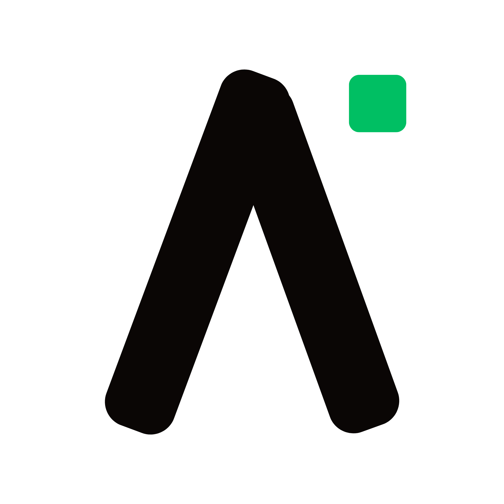

<p align="center">
  
</p>

<h1 align="center">ApplyKit</h1>

<p align="center">
  <strong>AI-powered job application automation for LinkedIn &amp; Naukri</strong><br />
  Discover, score, and auto-apply to jobs — while you focus on what matters.
</p>

<p align="center">
  &nbsp;
  &nbsp;
  &nbsp;
  &nbsp;
  &nbsp;
  &nbsp;
  
</p>

<br />

> **🚧 Under Active Development** — ApplyKit is being actively built and improved. Features, APIs, and the UI may change frequently. Contributions, bug reports, and feedback are very welcome!

<br />

## Overview

**ApplyKit** is a desktop application that automates your job search pipeline end-to-end. It uses AI to discover relevant job postings, score them against your profile, and auto-fill applications — all running locally on your machine with full control and visibility.

Key capabilities:

- 🔍 **Job Discovery** — Scrapes LinkedIn and Naukri for roles matching your configured search criteria
- 🧠 **AI Scoring** — Ranks each posting against your profile using configurable LLM providers (OpenAI, OpenRouter, Ollama, Google Gemini)
- ✅ **Smart Queue** — Review scored jobs before applying, approve or skip with one click
- 🤖 **Auto-Apply** — Playwright-powered browser automation fills and submits applications
- 🗃️ **QA Memory Bank** — Persists your custom Q&A answers so the AI reuses them consistently across platforms
- 📄 **Document Management** — Attach and switch between multiple resumes per profile
- 📊 **History & Analytics** — Full audit trail of every application with status tracking

<br />

## Tech Stack

| Layer | Technology |
|---|---|
| Desktop Shell | [Electron](https://www.electronjs.org) v43 |
| UI Framework | [React](https://react.dev) v19 + [TypeScript](https://www.typescriptlang.org) v7 |
| Build Tool | [Electron Vite](https://electron-vite.org) |
| Styling | [TailwindCSS](https://tailwindcss.com) v4 + [Shadcn UI](https://ui.shadcn.com) |
| Browser Automation | [Playwright](https://playwright.dev) |
| Local Database | [better-sqlite3](https://github.com/WiseLibs/better-sqlite3) |
| AI / LLM | [Vercel AI SDK](https://sdk.vercel.ai) — OpenAI, OpenRouter, Ollama, Gemini |
| IPC | Conveyor (type-safe Zod-validated IPC) |
| Package Manager | [Bun](https://bun.sh) |

<br />

## Getting Started

### Prerequisites

- [Bun](https://bun.sh) v1.3+
- [Node.js](https://nodejs.org) v20+
- Playwright browser binaries (installed automatically)

### Installation

```bash
# Clone the repository
git clone https://github.com/neerajlovecyber/applykit
cd applykit

# Install dependencies
bun install
```

### Development

```bash
bun run dev
```

This starts Electron with Vite hot-module replacement. Changes to both the renderer and main process are reflected instantly.

<br />

## Project Structure

```
applykit/
├── app/                  # Renderer process (React UI)
│   ├── assets/           # Static assets (logos, images)
│   ├── components/       # Reusable UI components
│   ├── hooks/            # Custom React hooks
│   ├── layouts/          # Page layout wrappers
│   ├── pages/            # Route-level page components
│   └── stores/           # Zustand global state
│
├── lib/                  # Main process & shared logic
│   ├── conveyor/         # Type-safe IPC (schemas, API classes, handlers)
│   ├── execution/        # Playwright automation engine & browser pool
│   ├── main/             # Electron main process entry & DB queries
│   └── preload/          # Context bridge / preload scripts
│
├── resources/            # Build resources (app icons)
└── electron.vite.config.ts
```

<br />

## Configuration

On first launch, the Role Onboarding Wizard guides you through:

1. **Profile Setup** — Name, target roles, seniority level, and location preferences
2. **Document Upload** — Attach your resume(s) in PDF format
3. **AI Provider** — Select and configure your preferred LLM (API key required for cloud providers; Ollama runs locally)
4. **Platform Credentials** — LinkedIn and/or Naukri login details for automation

All data is stored locally in a SQLite database. Nothing is sent to external servers unless you choose a cloud LLM provider.

<br />

## AI Provider Support

ApplyKit supports multiple LLM backends via the Vercel AI SDK:

| Provider | Models | Notes |
|---|---|---|
| OpenAI | GPT-4o, GPT-4.1 | Requires API key |
| OpenRouter | 100+ models | Requires API key |
| Google Gemini | Gemini 2.0/2.5 | Requires API key |
| Ollama | Any local model | Runs fully offline |

Configure your provider in **Settings → AI Model**.

<br />

## Building for Distribution

```bash
# Windows
bun run build:win

# macOS
bun run build:mac

# Linux
bun run build:linux

# Unpackaged (all platforms, for testing)
bun run build:unpack
```

Output artifacts are written to the `dist/` directory.

<br />

## IPC Architecture — Conveyor

Inter-process communication between the Electron main process and the React renderer is handled by **Conveyor** — a type-safe IPC layer built on Zod schemas.

```ts
// Renderer — call main process handlers via hook
const conveyor = useConveyor();
const profiles = await conveyor.data.getProfiles();
```

All IPC channels are validated at runtime. See [`lib/conveyor/`](lib/conveyor/) for schemas, API classes, and handlers.

<br />

## License

[MIT](LICENSE)

