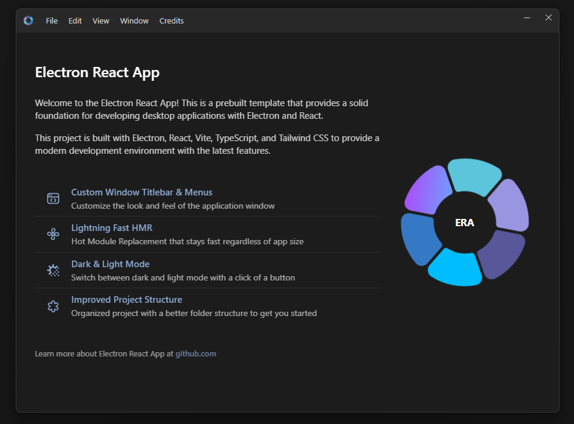

<p align="center">
  
</p>

<h1 align="center">ApplyKit</h1>

<p align="center">
  <strong>AI-powered job application automation for LinkedIn &amp; Naukri</strong><br />
  Discover, score, and auto-apply to jobs — while you focus on what matters.
</p>

<p align="center">
  &nbsp;
  &nbsp;
  &nbsp;
  &nbsp;
  &nbsp;
  
</p>

<br />

## Overview

**ApplyKit** is a desktop application that automates your job search pipeline end-to-end. It uses AI to discover relevant job postings, score them against your profile, and auto-fill applications — all running locally on your machine with full control and visibility.

Key capabilities:

- 🔍 **Job Discovery** — Scrapes LinkedIn and Naukri for roles matching your configured search criteria
- 🧠 **AI Scoring** — Ranks each posting against your profile using configurable LLM providers (OpenAI, OpenRouter, Ollama, Google Gemini)
- ✅ **Smart Queue** — Review scored jobs before applying, approve or skip with one click
- 🤖 **Auto-Apply** — Playwright-powered browser automation fills and submits applications
- 🗃️ **QA Memory Bank** — Persists your custom Q&A answers so the AI reuses them consistently across platforms
- 📄 **Document Management** — Attach and switch between multiple resumes per profile
- 📊 **History & Analytics** — Full audit trail of every application with status tracking

<br />

## Tech Stack

| Layer | Technology |
|---|---|
| Desktop Shell | [Electron](https://www.electronjs.org) v43 |
| UI Framework | [React](https://react.dev) v19 + [TypeScript](https://www.typescriptlang.org) v7 |
| Build Tool | [Electron Vite](https://electron-vite.org) |
| Styling | [TailwindCSS](https://tailwindcss.com) v4 + [Shadcn UI](https://ui.shadcn.com) |
| Browser Automation | [Playwright](https://playwright.dev) |
| Local Database | [better-sqlite3](https://github.com/WiseLibs/better-sqlite3) |
| AI / LLM | [Vercel AI SDK](https://sdk.vercel.ai) — OpenAI, OpenRouter, Ollama, Gemini |
| IPC | Conveyor (type-safe Zod-validated IPC) |
| Package Manager | [Bun](https://bun.sh) |

<br />

## Getting Started

### Prerequisites

- [Bun](https://bun.sh) v1.3+
- [Node.js](https://nodejs.org) v20+
- Playwright browser binaries (installed automatically)

### Installation

```bash
# Clone the repository
git clone https://github.com/your-org/applykit
cd applykit

# Install dependencies
bun install
```

### Development

```bash
bun run dev
```

This starts Electron with Vite hot-module replacement. Changes to both the renderer and main process are reflected instantly.

<br />

## Project Structure

```
applykit/
├── app/                  # Renderer process (React UI)
│   ├── assets/           # Static assets (logos, images)
│   ├── components/       # Reusable UI components
│   ├── hooks/            # Custom React hooks
│   ├── layouts/          # Page layout wrappers
│   ├── pages/            # Route-level page components
│   └── stores/           # Zustand global state
│
├── lib/                  # Main process & shared logic
│   ├── conveyor/         # Type-safe IPC (schemas, API classes, handlers)
│   ├── execution/        # Playwright automation engine & browser pool
│   ├── main/             # Electron main process entry & DB queries
│   └── preload/          # Context bridge / preload scripts
│
├── resources/            # Build resources (app icons)
└── electron.vite.config.ts
```

<br />

## Configuration

On first launch, the Role Onboarding Wizard guides you through:

1. **Profile Setup** — Name, target roles, seniority level, and location preferences
2. **Document Upload** — Attach your resume(s) in PDF format
3. **AI Provider** — Select and configure your preferred LLM (API key required for cloud providers; Ollama runs locally)
4. **Platform Credentials** — LinkedIn and/or Naukri login details for automation

All data is stored locally in a SQLite database. Nothing is sent to external servers unless you choose a cloud LLM provider.

<br />

## AI Provider Support

ApplyKit supports multiple LLM backends via the Vercel AI SDK:

| Provider | Models | Notes |
|---|---|---|
| OpenAI | GPT-4o, GPT-4.1 | Requires API key |
| OpenRouter | 100+ models | Requires API key |
| Google Gemini | Gemini 2.0/2.5 | Requires API key |
| Ollama | Any local model | Runs fully offline |

Configure your provider in **Settings → AI Model**.

<br />

## Building for Distribution

```bash
# Windows
bun run build:win

# macOS
bun run build:mac

# Linux
bun run build:linux

# Unpackaged (all platforms, for testing)
bun run build:unpack
```

Output artifacts are written to the `dist/` directory.

<br />

## IPC Architecture — Conveyor

Inter-process communication between the Electron main process and the React renderer is handled by **Conveyor** — a type-safe IPC layer built on Zod schemas.

```ts
// Renderer — call main process handlers via hook
const conveyor = useConveyor();
const profiles = await conveyor.data.getProfiles();
```

All IPC channels are validated at runtime. See [`lib/conveyor/`](lib/conveyor/) for schemas, API classes, and handlers.

<br />

## License

[MIT](LICENSE)


<br />

 &nbsp;
 &nbsp;
 &nbsp;
 &nbsp;
 &nbsp;


<br />

<p align="center">
    
</p>

<p align="center">
    <a href="https://imgur.com/B5pGkDk">Watch Video Preview</a>
</p>

<br />

## Stack

🔹 **[Electron](https://www.electronjs.org)** - Cross-platform desktop application framework.<br />
🔹 **[React](https://react.dev)** - The library for web and native user interfaces.<br />
🔹 **[TypeScript](https://www.typescriptlang.org)** - Type-safe JavaScript.<br />
🔹 **[Shadcn UI](https://ui.shadcn.com)** - Beautiful and accessible component library.<br />
🔹 **[TailwindCSS](https://tailwindcss.com)** - Utility-first CSS framework.<br />
🔹 **[Electron Vite](https://electron-vite.org)** - Lightning-fast build tool based on **Vite** for fastest hot-reload.<br />
🔹 **[Electron Builder](https://www.electron.build/index.html)** - Configured for packaging applications.<br />

<br />

## In-Built Features

| Feature                     | Description                                                                    |
| --------------------------- | ------------------------------------------------------------------------------ |
| **Conveyor**                | Type-safe inter-process communication with Zod validation                      |
| **Custom Titlebar & Menus** | Style the window titlebar and menus as you want                                |
| **Clean Project Structure** | Separation of main and renderer processes                                      |
| **Resources Protocol**      | Access local file resources via `res://` protocol                              |
| **Import Path Aliases**     | Keep your imports organized and clean                                          |
| **Theme Switcher**          | Built-in theme switching for dark and light mode                               |
| **Error Boundary**          | Built-in React error boundary with detailed error reporting                    |
| **Welcome Kit**             | Interactive showcase with Framer Motion animations                             |
| **Code Formatting**         | Prettier and ESLint pre-configured for code quality                            |
| **Hot Reload**              | Lightning-fast development with Vite's HMR                                     |
| **VS Code Debugging**       | Pre-configured launch configurations for debugging main and renderer processes |

<br />

## Installation

Clone the repository:

```bash
# Clone the repository
git clone https://github.com/guasam/electron-react-app

# Change directory
cd electron-react-app

# Install dependencies (use any package manager: npm, yarn, pnpm, bun)
npm install
```

<br />

## Development

Start the development server:

```bash
npm run dev
```

This will start Electron with hot-reload enabled so you can see changes in real time.

<br />

## Conveyor - Inter-Process Communication

**Conveyor** is a type-safe IPC system that enables secure communication between your React frontend and Electron's main process. It uses Zod schemas for runtime validation and provides full TypeScript support.

🔹 **Type-safe** - Full TypeScript support with compile-time and runtime validation<br />
🔹 **Secure** - Validates all data using Zod schemas<br />
🔹 **Modular** - Clean API structure with organized handlers<br />
🔹 **Simple** - Easy-to-use React hooks and global APIs<br />

<br />

### Quick Start

Use the `useConveyor` hook in your React components:

```tsx
import { useConveyor } from "@/app/hooks/use-conveyor";

function MyComponent() {
  const { version } = useConveyor("app");
  const { windowMinimize } = useConveyor("window");

  const handleGetVersion = async () => {
    console.log("App version:", await version());
    console.log("App version:", await window.conveyor.app.version()); // OR
  };

  return (
    <div>
      <button onClick={handleGetVersion}>Get Version</button>
      <button onClick={windowMinimize}>Minimize Window</button>
    </div>
  );
}
```

### Available APIs

Conveyor provides two ways to access IPC methods:

```tsx
// Method 1: React Hook (Recommended)
const { version } = useConveyor("app");
await version();

// Method 2: React Hook Global Conveyor
const conveyor = useConveyor();
await conveyor.app.version();

// Method 3: Global Window Object
await window.conveyor.app.version();
```

### Built-in APIs

| API      | Description                | Example                            |
| -------- | -------------------------- | ---------------------------------- |
| `app`    | App specfiic operations    | `conveyor.app.version()`           |
| `window` | Window specific operations | `conveyor.window.windowMinimize()` |

<br />

### Creating Custom APIs

Follow these 4 simple steps to add your own IPC methods:

#### Step 1: Define Schema

Create a schema in `lib/conveyor/schemas/app-schema.ts`:

```ts
import { z } from "zod";

export const appIpcSchema = {
  // Simple method with no parameters
  "get-app-info": {
    args: z.tuple([]),
    return: z.object({
      name: z.string(),
      version: z.string(),
      platform: z.string(),
    }),
  },

  // Method with parameters
  "save-user-preference": {
    args: z.tuple([
      z.object({
        key: z.string(),
        value: z.string(),
      }),
    ]),
    return: z.boolean(),
  },
} as const;
```

#### Step 2: Add API Method

Update `lib/conveyor/api/app-api.ts`:

```ts
export class AppApi extends ConveyorApi {
  getAppInfo = () => this.invoke("get-app-info");
  saveUserPreference = (key: string, value: string) =>
    this.invoke("save-user-preference", { key, value });
}
```

#### Step 3: Implement Handler

Add handler in `lib/conveyor/handlers/app-handler.ts`:

```ts
import { handle } from "@/lib/main/shared";
import { app } from "electron";

export const registerAppHandlers = () => {
  handle("get-app-info", () => ({
    name: app.getName(),
    version: app.getVersion(),
    platform: process.platform,
  }));

  handle("save-user-preference", async ({ key, value }) => {
    // Save to file, database, etc.
    console.log(`Saving ${key}: ${value}`);
    return true;
  });
};
```

#### Step 4: Register Handler

In `lib/main/app.ts`:

```ts
import { registerAppHandlers } from "@/lib/conveyor/handlers/app-handler";

// During app initialization
registerAppHandlers();
```

### Usage in Components

```tsx
function SettingsComponent() {
  const conveyor = useConveyor();
  const [appInfo, setAppInfo] = useState(null);

  useEffect(() => {
    // Get app information
    conveyor.app.getAppInfo().then(setAppInfo);
  }, []);

  const saveTheme = (theme: string) => {
    conveyor.app.saveUserPreference("theme", theme);
  };

  return (
    <div>
      <h2>App Info</h2>
      {appInfo && (
        <p>
          {appInfo.name} v{appInfo.version} on {appInfo.platform}
        </p>
      )}

      <button onClick={() => saveTheme("dark")}>Set Dark Theme</button>
    </div>
  );
}
```

### Error Handling

```tsx
const handleApiCall = async () => {
  try {
    const result = await conveyor.app.getAppInfo();
    console.log("Success:", result);
  } catch (error) {
    console.error("API call failed:", error);
    // Handle validation errors, network issues, etc.
  }
};
```

### Type Safety Benefits

```tsx
// ✅ TypeScript enforces correct types
const info = await conveyor.app.getAppInfo(); // Returns { name: string, version: string, platform: string }

// ❌ TypeScript error - wrong parameter type
const result = await conveyor.app.saveUserPreference(123, "value"); // Error: Expected string, got number

// ✅ Runtime validation ensures data integrity
const valid = await conveyor.app.saveUserPreference("theme", "dark"); // Validates at runtime
```

📖 **For advanced usage and detailed documentation, see [Conveyor README](lib/conveyor/README.md)**

<br />

## Custom Window Components

This template includes a custom window implementation with:

- Custom titlebar with app icon
- Window control buttons (minimize, maximize, close)
- Menu system with keyboard shortcuts
- Dark/light mode toggle
- Cross-platform support for Windows and macOS

<br />

### Titlebar Menu Toggle

The titlebar menu can be toggled using:

- **Windows**: Press the `Alt` key
- **macOS**: Press the `Option (⌥)` key

When you press the toggle key:

- If the menu is hidden, it becomes visible
- If the menu is already visible, it gets hidden
- The menu only toggles if menu items are available

<br />

### Customizing Menu Items

To add, remove or modify menu items, update the following file:

- `app/components/window/menus.ts`

<br />

## Tailwind CSS

The project supports **Tailwind** for styling:

```ts
// Example component with Tailwind classes
const Button = () => (
  <button className="px-4 py-2 text-white rounded-md">
    Click me
  </button>
);
```

<br />

## Key Directories Explained

#### `app/` - Renderer Process

- **React application** that runs in the browser window
- Contains all UI components, styles, and client-side logic
- Uses Vite for fast development and building

#### `lib/conveyor/` - Conveyor - Inter-Process Communication

- **Type-safe communication** between renderer and main processes
- **API classes** provide clean interfaces for IPC calls
- **Handlers** implement the actual logic in the main process
- **Schemas** define data contracts with Zod validation

#### `lib/main/` - Main Process

- **Electron main process** code
- Handles window creation, app lifecycle, and system integration
- Registers IPC handlers and manages app state

#### `lib/preload/` - Preload Scripts

- **Security bridge** between renderer and main processes
- Exposes safe APIs to the renderer process
- Implements context isolation for security

<br />

## Development Workflow

1. **UI Development**: Work in `app/` directory with React components
2. **IPC Communication**: Define schemas, add API methods, implement handlers
3. **Window Features**: Customize window behavior in `app/components/window/`
4. **Prettier Formatting**: Use `npm run format` to format the code.
5. **ESLint**: Use `npm run lint` to lint the code.

<br />

## Path Aliases

The project uses TypeScript path aliases for clean imports:

```ts
// Instead of relative paths like:
import { Button } from "../../../components/ui/button";

// Use clean aliases:
import { Button } from "@/app/components/ui/button";
import { conveyor } from "@/lib/conveyor/api";
```

Configured aliases by default, customise as you want:

- `@/` → `app/` (application code - renderer process)
- `@/lib/` → `lib/` (shared library code containing conveyor, main, preload, etc.)
- `@/resources/` → `resources/` (build resources for the application)

<br />

## Building for Production

Build the application for your platform:

```bash
# For Windows
npm run build:win

# For macOS
npm run build:mac

# For Linux
npm run build:linux

# Unpacked for all platforms
npm run build:unpack
```

Distribution files will be located in the `dist` directory.
